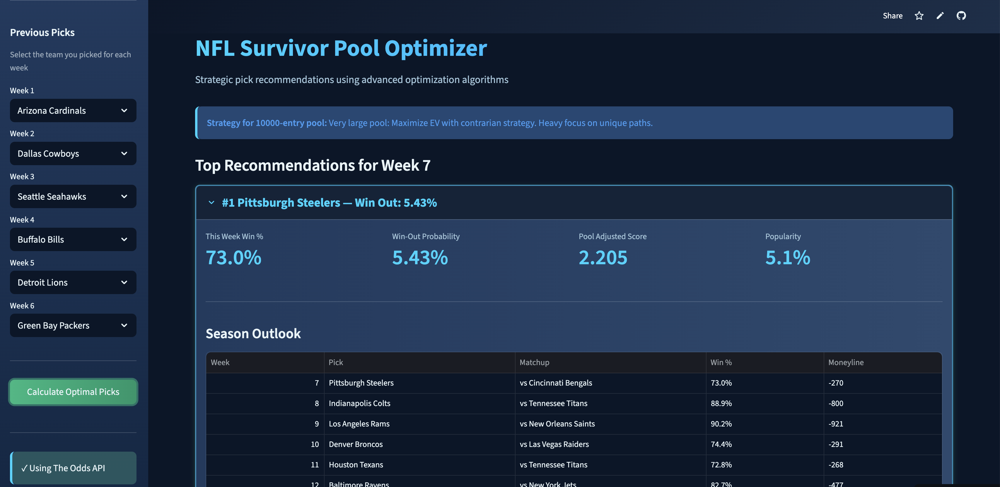

# NFL Survivor AI - Advanced Prediction & Optimization System

An advanced, ML-powered NFL Survivor Pool optimizer that combines cutting-edge machine learning prediction models with sophisticated optimization algorithms. Built on research from leading sports analytics papers and enhanced with professional-grade features.

[](https://colab.research.google.com/github/elliotttmiller/survivorai/blob/main/SurvivorAI_Colab_Notebook.ipynb)

**🚀 NEW: [Google Colab Notebook](SurvivorAI_Colab_Notebook.ipynb)** - Run the complete system in your browser with zero setup! See [Colab Guide](COLAB_GUIDE.md) for details.

---

**Based on**: [jlattanzi4/nfl-survivor-optimizer](https://github.com/jlattanzi4/nfl-survivor-optimizer)

**Enhanced with research from**:
- [Frontiers in Sports: NFL Win Prediction with ML](https://www.frontiersin.org/journals/sports-and-active-living/articles/10.3389/fspor.2025.1638446/full)
- Real-time NFL prediction algorithms and advanced statistical methods

---

## 🎯 Quick Start Options

### Option 1: Google Colab (Recommended for Most Users)

**Zero setup, runs in browser, completely automated!**

1. Click the "Open in Colab" badge above
2. Click `Runtime` → `Run all`
3. Enter your pool info when prompted
4. Get optimized recommendations!

**Features:**
- ✅ No installation required
- ✅ Auto-detects current NFL week
- ✅ Real-time data integration
- ✅ Complete ML pipeline
- ✅ One-click execution

See [Colab Guide](COLAB_GUIDE.md) for detailed instructions.

### Option 2: Local Installation

For advanced users who want full control:

```bash
git clone https://github.com/elliotttmiller/survivorai.git
cd survivorai
pip install -r requirements.txt
streamlit run app.py
```

See [Setup Guide](SETUP.md) for detailed installation instructions.

---

## Overview

NFL Survivor Pools require you to pick one team to win each week, but you can only use each team once per season. This creates a complex optimization problem: which team should you pick this week to maximize your chances of surviving the entire season?

**Survivor AI** solves this with a multi-layered approach:
1. **Advanced ML Prediction Models** - Random Forest, Neural Networks, and XGBoost ensemble
2. **Hungarian Algorithm Optimization** - Optimal team-to-week assignment
3. **Real-Time Data Integration** - Live betting odds and consensus picks
4. **Pool Strategy Analysis** - Tailored recommendations based on pool size

## Key Features

### Machine Learning Prediction Models
- **Random Forest Regression** - High accuracy with feature importance analysis
- **Neural Network** - Deep learning for complex pattern recognition (highest research accuracy)
- **XGBoost** - Gradient boosting for robust predictions
- **Ensemble Methods** - Weighted combination of all models for superior performance

### Advanced Feature Engineering
- **Pythagorean Expectation** - NFL-optimized win probability (exponent 2.37)
- **Elo Rating System** - Dynamic team strength ratings
- **Offensive/Defensive Metrics** - Points per game, yards per play, efficiency ratings
- **Recent Form Analysis** - Momentum and trend tracking
- **Rest Advantage** - Scheduling factors and bye week considerations

### Optimization & Strategy
- **Hungarian Algorithm** - Optimal team-to-week assignment path
- **Pool Size Intelligence** - Contrarian vs. consensus strategy adjustment
- **Monte Carlo Simulation** - Variance analysis and risk assessment
- **Expected Value Calculation** - Pool dynamics consideration

### Data Integration
- **The Odds API** - Real-time moneylines and spreads
- **SurvivorGrid** - Consensus picks and future projections
- **Smart Caching** - Efficient data management
- **Multi-Source Blending** - Best of both worlds

### User Experience
- **Google Colab Notebook** - Zero-setup, browser-based automation (NEW!)
- **Interactive Streamlit UI** - Beautiful, responsive interface
- **Week-by-Week Selection** - Smart filtering and validation
- **Complete Season Paths** - Full week 1-18 optimal strategy
- **Visual Analytics** - Charts, metrics, and insights
- **Auto Season Detection** - Automatically detects current NFL week

### Automation & Deployment
- **Fully Automated Workflow** - One-click execution in Colab
- **Real-Time Updates** - Auto-detects current season and week
- **Cloud Ready** - Runs in Google Colab or local environment
- **Export Options** - CSV download for tracking
- **API Integration** - Seamless connection to data sources

## How It Works

### The Optimization Algorithm

The app uses the **Hungarian Algorithm** (linear sum assignment) to solve the assignment problem:
- **Goal**: Maximize the probability of winning out (surviving all remaining weeks)
- **Constraint**: Each team can only be used once
- **Method**: Convert to a cost minimization problem using `-log(win_probability)`
  - Minimizing the sum of `-log(p)` = Maximizing the product of probabilities
  - This finds the path with the highest overall win-out probability

### Data Sources

1. **The Odds API** - Current week moneylines (accurate, real-time betting odds)
2. **SurvivorGrid** - Future week projections and pick percentages (consensus data)

### Pool Size Strategy

- **Small pools (< 50)**: Favor higher win probabilities
- **Medium pools (50-200)**: Balance win probability with contrarian value
- **Large pools (200-1000)**: Emphasize contrarian picks to differentiate
- **Very large pools (> 1000)**: Heavy contrarian strategy required

## Installation

### Prerequisites

- Python 3.8+
- pip

### Setup

1. Clone the repository:
```bash
git clone https://github.com/jlattanzi4/nfl-survivor-optimizer.git
cd nfl-survivor-optimizer
```

2. Install dependencies:
```bash
pip install -r requirements.txt
```

3. Create a `.env` file:
```bash
cp .env.example .env
```

4. (Optional) Add your Odds API key to `.env`:
   - Get a free API key at [The Odds API](https://the-odds-api.com/)
   - Add it to `.env`: `ODDS_API_KEY=your_key_here`
   - Free tier includes 500 requests/month

5. Run the app:
```bash
streamlit run app.py
```

## Usage

1. **Configure Your Pool**: Enter pool size and current week in the sidebar
2. **Enter Previous Picks**: Select which teams you've already used each week
3. **Calculate**: Click "Calculate Optimal Picks" to see recommendations
4. **Review Options**: Explore the top 5 picks with complete season paths
5. **Make Your Decision**: Choose based on your risk tolerance and pool dynamics

## Project Structure

```
survivorai/
├── app.py                          # Main Streamlit application
├── config.py                       # Configuration and constants
├── requirements.txt                # Python dependencies (with ML libraries)
├── .env.example                    # Environment configuration template
├── data_collection/
│   ├── odds_api.py                # The Odds API client
│   ├── survivorgrid_scraper.py   # SurvivorGrid web scraper
│   ├── schedule_data.py           # NFL schedule management
│   └── data_manager.py           # Data integration layer
├── optimizer/
│   ├── hungarian_optimizer.py     # Hungarian algorithm optimization
│   └── pool_calculator.py        # Pool size strategy adjustment
├── ml_models/
│   ├── feature_engineering.py     # NFL feature extraction
│   ├── prediction_models.py       # ML models (RF, NN, XGBoost)
│   └── ml_predictor.py           # Integrated ML predictor
└── utils/
    └── cache_manager.py          # Caching system
```

## Technical Highlights

### Technologies Used
- **Streamlit**: Interactive web application framework
- **SciPy**: Linear sum assignment (Hungarian algorithm)
- **Pandas**: Data manipulation and analysis
- **Requests + BeautifulSoup**: Web scraping
- **NumPy**: Numerical computations

### Key Algorithms
- **Linear Sum Assignment**: Optimal team-to-week matching
- **Logarithmic Cost Function**: Converts probability product to sum
- **Spread-to-Probability Conversion**: `P(win) = 1 / (1 + 10^(spread/14))`
- **Moneyline-to-Probability**: Handles favorite vs. underdog calculations

## Live Demo

**Try it now:** [https://nfl-survivor-optimizer.streamlit.app/](https://nfl-survivor-optimizer.streamlit.app/)

No installation required - just visit the link and start optimizing your picks!

## Screenshots



*Interactive interface showing optimal pick recommendations with complete season outlook*

## Advanced Research Integration

This system incorporates findings from peer-reviewed research:

### From "Advancing NFL win prediction" (Frontiers in Sports)
- **Neural Networks** demonstrated highest predictive accuracy
- **Random Forest** provides excellent balance of accuracy and interpretability
- **Pythagorean expectation** with exponent 2.37 optimized for NFL
- **Key Performance Indicators**: Points scored/allowed, offensive efficiency, turnovers

### Feature Engineering Best Practices
- **Elo ratings** adapted for NFL with K-factor 20
- **Home field advantage** quantified (~65 Elo points)
- **Recent form** weighted with exponential decay
- **Rest days** normalized for scheduling factors

## Future Enhancements

- ✅ ML-based win probability predictions (IMPLEMENTED)
- ✅ Advanced feature engineering (IMPLEMENTED)
- 🔄 Historical performance tracking (IN PROGRESS)
- 🔄 Monte Carlo simulations for variance analysis (IN PROGRESS)
- 📋 Multi-entry optimization (for pools allowing multiple entries)
- 📋 Weekly email notifications with picks
- 📋 Real-time game tracking and live win probability updates
- 📋 Advanced visualization dashboard
- 📋 API for programmatic access

## License

MIT License - feel free to use this for your own survivor pools!

## Acknowledgments

- Inspired by optimization methodology discussed on r/NFLSurvivorPool
- Data provided by The Odds API and SurvivorGrid
- Built with Streamlit

---

**Note**: This tool is for entertainment and educational purposes. Always do your own research before making picks. Past performance does not guarantee future results.
